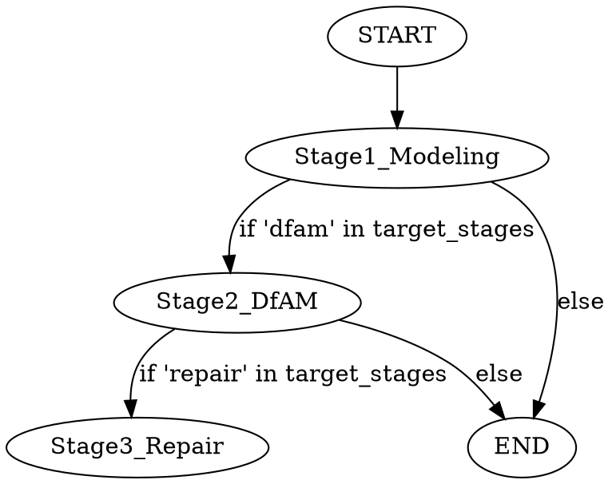

# Phase 1: 核心调度架构与子图可插拔化 (Hierarchical LangGraph)

## Overview

本项目致力于通过 AI Agent 替代传统工业 CAD/CAE/CAM 软件，实现从 2D 图纸/意图到 3D 打印切片文件的端到端全流程。

### 全流程演进深度分析
在《AI 驱动的 3D 打印全流程架构设计与演进路线图》中，我们确立了“双大脑架构”：**机械大脑**负责通过代码生成完美的 B-Rep 工程模型；**艺术大脑**负责通过视觉模型生成有机网格。
这要求我们将工业软件的 6 大传统工序映射为 Python 平台内的原生/AI替代方案：

1. **CAD Modeling (概念设计)**：从单纯的代码生成，演进为“结构化中间态 (AST/JSON) -> CadQuery”以及“视觉网格生成 + PCA对齐/缩放”。AI 扮演结构工程师。
2. **DfAM (拓扑优化)**：通过引入数学极小曲面 (TPMS) 或 ToPy 等库，进行应力分析与轻量化点阵生成。AI 扮演 DfAM 工艺专家。
3. **Mesh Repair (模型清洗与固化 - 分水岭)**：这是视觉模型走向工程的“生死劫”。需要从简单的 `trimesh` 缝合，演进到基于 OpenVDB 的窄带 SDF 修复，并结合 `manifold3d` 实现混合布尔运算。AI 扮演几何主治医师。
4. **Build Prep (工艺与支撑)**：通过 `scipy.optimize` 计算最佳摆放角度以最小化支撑，并生成树状支撑结构。AI 扮演 CAM 排版工程师。
5. **Process Simulation (热力学仿真)**：利用固有应变法 (Inherent Strain) 或轻量级 FEA 预测打印翘曲变形并反向补偿。AI 扮演热力仿真专家。
6. **Slicing & Toolpath (切片与路径)**：将 3D 降维为 2D，利用 `Shapely` 生成内外壁与填充，或静默调用 CuraEngine。AI 扮演数控编程员。

### 本阶段架构目标：底层骨架优先
面对上述庞大复杂的算法矩阵，如果我们直接试图从零开始实现每一个细节，项目将陷入泥潭。
因此，**第一阶段（Phase 1）的绝对核心是：利用 LangGraph 构建一个包含这 6 大阶段的、全节点可插拔的 `Agentic State Machine` 骨架**。我们将采用 **分层子图架构 (Hierarchical Subgraphs)**，主图仅负责工序间的跳转与状态流转，而具体的算法（哪怕现在只是一个什么都不做的 Mock 节点）都被封装在各自独立的子图内部。这为后续各个击破提供了坚实的“试验台”。

## Checklist
- [x] 1. Explore project context
- [x] 2. Ask clarifying questions (User selected Option B: Hierarchical Subgraphs)
- [x] 3. Propose approaches
- [x] 4. Present design sections
- [x] 5. Write design doc
- [ ] 6. Transition to implementation

## 架构设计详解

### 1. 核心状态对象 (`PipelineContext`)
全局状态不仅需要记录简单的字符串，还需要追踪每一步的输入输出，因此我们使用字典或 `pydantic` 模型作为跨越所有子图的数据总线。

```python
from typing import TypedDict, Any

class AssetRegistry(TypedDict, total=False):
    # Modeling
    cadquery_script: str | None
    step_model: str | None
    raw_mesh: str | None
    
    # Repair
    watertight_mesh: str | None
    
    # Slicing
    gcode: str | None

class PipelineContext(TypedDict):
    job_id: str
    target_stages: list[str]      # 控制要执行哪些子图，如 ["modeling", "repair", "slicing"]
    
    # 状态数据
    input_type: str               # "text" | "drawing" | "organic"
    input_data: Any               # Prompt或图片路径
    
    assets: AssetRegistry         # 产物存储中心
    
    # 执行状态
    current_stage: str
    status: str                   # "running" | "completed" | "failed"
    error: str | None
```

### 2. 顶层主图路由 (Main Graph)

主图负责按序调用各个子图。使用 `add_conditional_edges` 检查 `PipelineContext.target_stages`，决定是否进入下一个子图。



### 3. 子图占位与插拔设计 (Subgraph Stubs)

在 Phase 1，我们将建立 6 个子图的“空壳”：

#### Stage 1: Modeling (概念与初步设计子图)
- **输入**: `input_data`
- **内部节点**: 
  - `route_by_type`: 区分工程件和有机件。
  - `generate_step`: （已有功能集成）调用现有 `generate_step_from_spec`，产出 `step_model`。
  - `generate_raw_mesh`: **占位节点**。调用视觉 3D 模型 API（未来对接 Tripo3D）。目前 Mock：如果输入是 organic，直接返回一个破损的 `dummy.obj` 路径写入 `assets.raw_mesh`。

#### Stage 2: DfAM (拓扑优化子图)
- **输入**: `assets.step_model` 或 `assets.raw_mesh`
- **内部节点**: 
  - `apply_lattice`: **占位节点**。目前直接透传输入到输出，记录一条日志 "Topology optimization skipped (stub)"。

#### Stage 3: Repair (模型清洗修复子图)
- **输入**: 各种格式的三维模型
- **内部节点**: 
  - `check_manifold`: 检查模型是否水密。如果是由 STEP 来的，通常通过。
  - `mesh_healer`: **占位节点**。未来的核心堡垒（包含体素化、OpenVDB 等算法）。目前 Mock：直接将输入复制并重命名为 `watertight.stl` 放入 `assets.watertight_mesh`。

#### Stage 4 & 5: Build Prep & Simulation (工艺与仿真子图)
- **输入**: `assets.watertight_mesh`
- **内部节点**: 均作为**占位透传节点**，打印日志 "Simulation skipped"。

#### Stage 6: Slicing (切片与路径规划子图)
- **输入**: `assets.watertight_mesh`
- **内部节点**: 
  - `slice_to_gcode`: **占位节点**。未来调用后台 CuraEngine 或自研 Shapely 切片算法。目前 Mock：在工作目录下生成一个体积为 0 的 `.gcode` 空文件，路径写入 `assets.gcode`。

### 4. 落地与后续攻坚任务拆解

在 Phase 1 骨架搭建完毕后，任何开发者或 Agent 可以独立接手以下任务，进行深度研发并替换对应的 Stub 节点：

1. **[攻坚任务 1] 艺术大脑生成节点 (Stage 1 - `generate_raw_mesh`)**
   - 研究与集成 Tripo3D/CSM 等 Text-to-3D 接口。
   - 引入 PCA 主成分分析与包围盒比例对齐算法，强制赋予视觉模型正确的物理尺寸。
2. **[攻坚任务 2] 面向增材的拓扑优化 (Stage 2 - `apply_lattice`)**
   - 引入纯数学晶格 (TPMS，如 Gyroid 陀螺面) 生成算法。
   - 结合包围盒生成三维 Voxel 矩阵并提取等值面，与外壳进行布尔运算。
3. **[攻坚任务 3] 网格固化神医 (Stage 3 - `mesh_healer` 子图重构)**
   - 引入 `pyopenvdb`，将“脏 Mesh”转化为具有窄带的 SDF 场，再提取回绝对水密的单壳体。
   - 在该子图内部建立 `[检查 -> 发现孔洞 -> 执行缝合 -> 再检查]` 的微型循环状态机。
4. **[攻坚任务 4] 混合布尔拼装 (连接 Stage 1 & 3)**
   - 使用 `manifold3d` 实现艺术水密网格与机械特征（高精度 CAD 孔位）的布尔运算融合。
5. **[攻坚任务 5] 打印工艺与支撑计算 (Stage 4 - `orientation_support`)**
   - 结合代价函数 $Cost = W_1 * H_{max} + W_2 * A_{overhang} + W_3 * V_{support}$，利用全局优化算法寻找最佳摆放旋转矩阵。
   - 基于 `trimesh.ray` 射线检测与寻路算法生成树状支撑。
6. **[攻坚任务 6] 自动切片引擎 (Stage 6 - `slice_to_gcode`)**
   - 利用 `Shapely` 进行多边形偏置和直线阵列填充，规划 G-code。
   - 备选方案：基于 `subprocess` 封装 Cura CLI 的静默调用。
